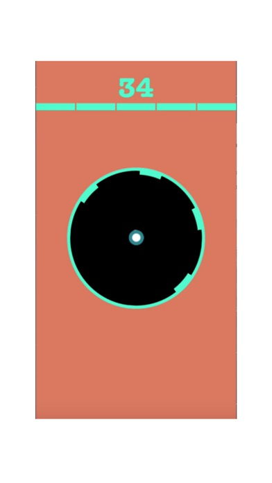
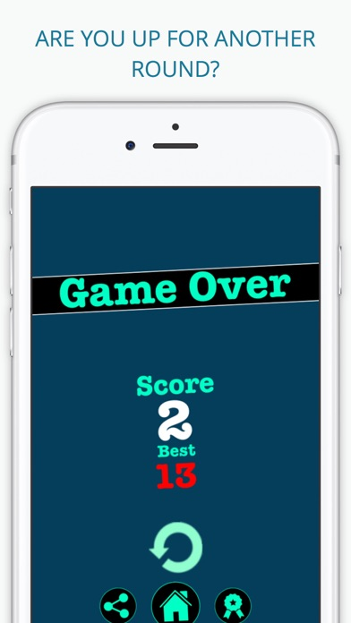
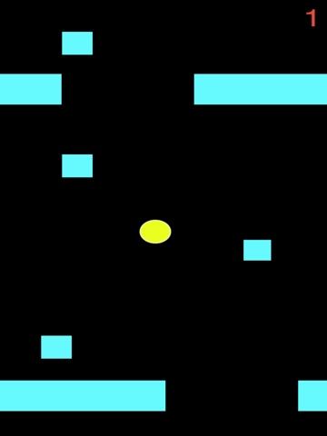
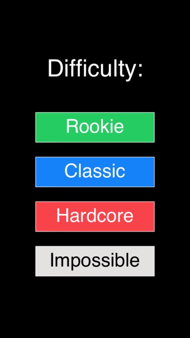
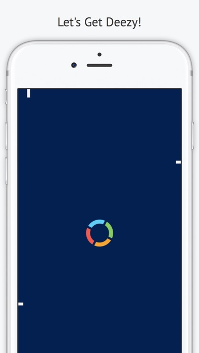
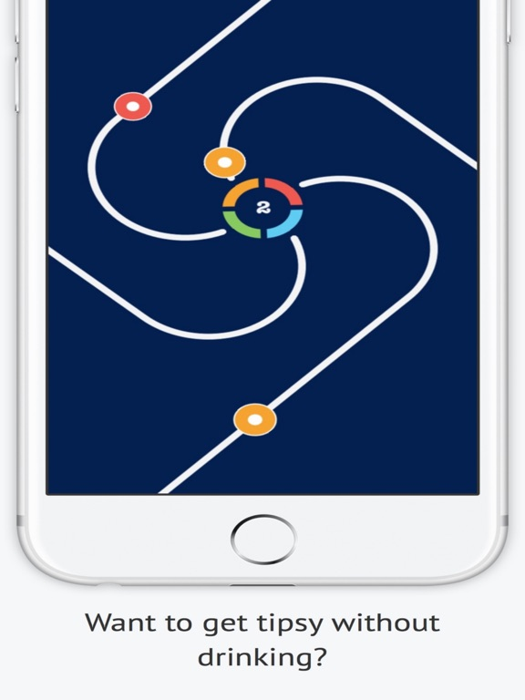

# personal-website

Minimal personal site (Astro, static).

## Structure
- `site/` — Astro frontend

## Frontend (Astro)
```bash
cd site
npm install
npm run dev
```

Build:
```bash
cd site
npm run build
npm run preview
```

## Games (screenshots)

A few early iOS games (screenshots sourced from TouchArcade’s app pages):

### Shooton
- App page: https://toucharcade.com/games/shooton

 

### UpJump
- App page: https://toucharcade.com/games/upjump

 

### Deezy
- App page: https://toucharcade.com/games/deezy

 

## Deployment

Planned: free static hosting (GitHub Pages / Cloudflare Pages / Netlify).
Deployed only with explicit Guy “GO”.

